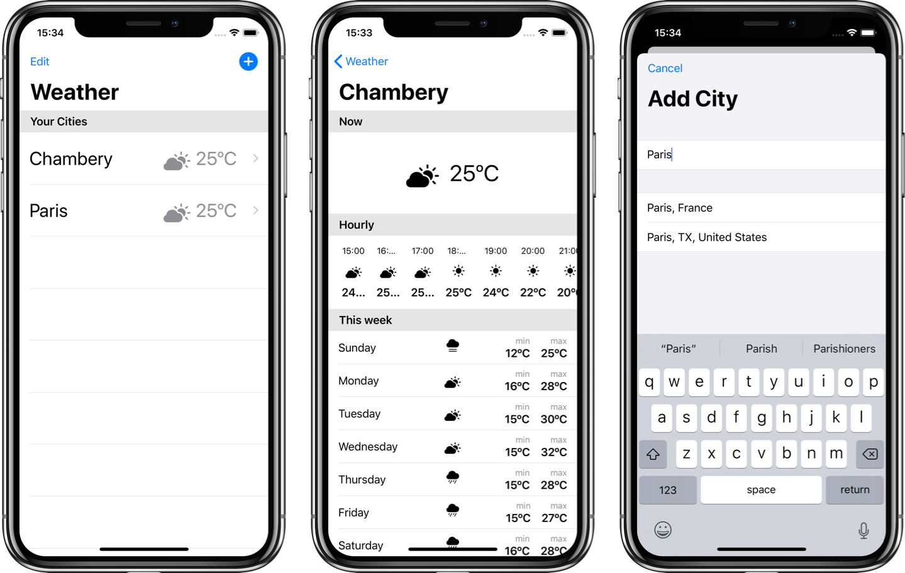

#  Weather



## What is Weather ?

Weather is a simple app that displays weather in SwiftUI. I saw a lot of tutorials on the web, that shows very basic feature of SwiftUI. I tried to combine all of them in one simple app to demonstrate how SwiftUI works. It shows asynchronous data fetch, binding and how to build user interfaces with SwiftUI.

## Installation

Weather use the [Dark Sky API](https://darksky.net/dev) to fetch weather data. To run this app, you'll need a Dark Sky API key. This is entirely free. To do so :
1. Create your account [here](https://darksky.net/dev/register) and get your Dark Sky API key.
2. Open the project, and go to the `WeatherManager.swift` file.
3. Replace `static let key: String = ""` by your key.

Weather require `Xcode 11.0`.

## Issues

This app have some issues probably due to SwiftUI as it is in beta. Here are the bugs I can list here. Feel free to correct them if you find how to.

#### Modal View
Closing a modal view doesn't seems to work. In the `NewCityView.swift` I tried to use a binding variable to close the modal view :
```swift
struct NewCityView : View {

    @Binding var isAddingCity: Bool

}
```
This variable doesn't have any effect on the modal presentation.

#### Layout
There are some layout issues in the hourly weather ScrollView. The text is wrapped where it should not be. I'm also using icons from the SF Symbols. But some of them are not working and they seems not to be all  correctly aligned.

## Contribution
Feel free to give some contribution to this very basic project. This will help us to better understand SwiftUI and how to use it to get started.

## Author
This app was made by me, Benjamin Pisano. If you want to contact me, you can send me DM on Twitter [@benjamin_pisano](https://twitter.com/benjamin_pisano). You can also see [my app](https://apps.apple.com/fr/app/aria/id1431709436?mt=12) on the Mac AppStore.
